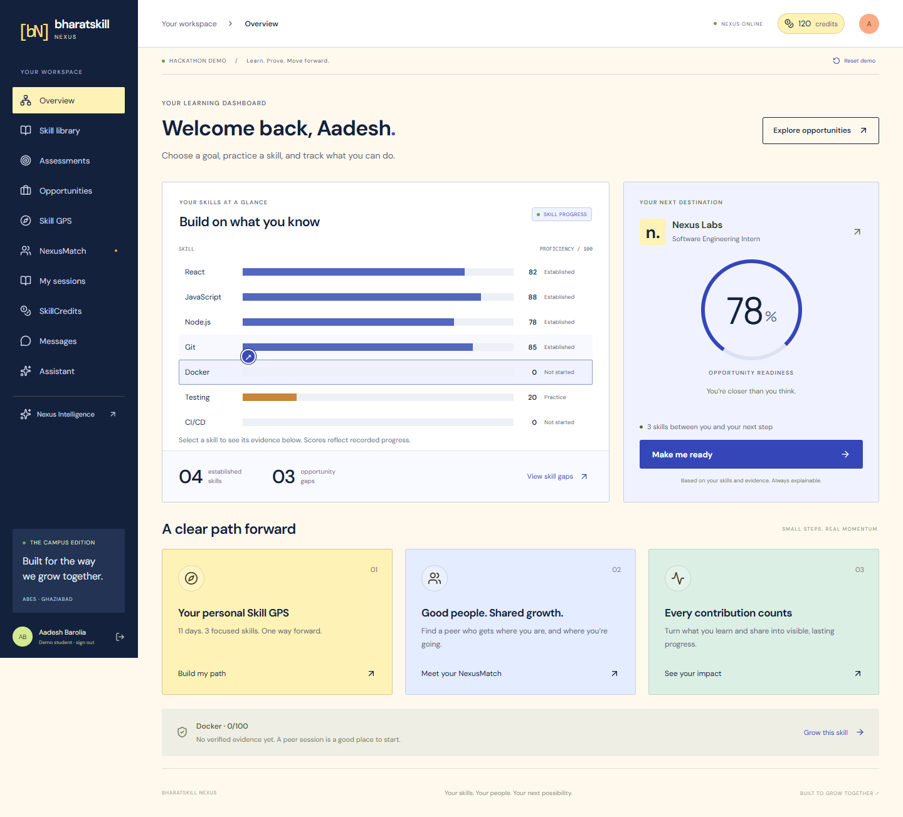

# BharatSkill Nexus

A working React/Vite/TypeScript + Express/TypeScript hackathon project connecting skills, opportunity readiness and peer learning.



## Start locally

Requirements: Node.js 22.12+ (verified on Node 24.15), npm and a modern browser. MongoDB and API keys are optional for the demo.

```sh
npm ci
npm run dev
```

Open **http://localhost:5173** and select **Explore the demo**. The API runs at **http://localhost:4000**. The app creates an independent seeded demo account and stores its session in an HttpOnly cookie. Reloading resumes that learner. **Reset demo** resets only that learner. Signing out and re-entering creates a new demo learner.

For configuration, copy `.env.example` to `.env` at the repository root. Defaults work without a file. Keep the local demo bound to loopback. File data is stored in `data/nexus.json` and survives restarts. Run only one file-mode API process.

```sh
# PowerShell
Copy-Item .env.example .env

# macOS / Linux
cp .env.example .env
```

## The 3–5 minute demo

1. Browse the illustrated learning home, search paths, and inspect the sample readiness chart. **Explore the demo** opens Aadesh’s workspace.
2. Select a skill bar to inspect its evidence. The demo SWE internship begins at **78% readiness** with Docker, Testing and CI/CD gaps.
3. **Make me ready** → select Docker in the simulator → **83% projected**. Select all three gaps → **92% projected**. This does not change earned progress.
4. **Build my Skill GPS** → see the 11-day self-guided / estimated 8-day peer-assisted route.
5. **NexusMatch** → Docker → **Learn with Harshit**. Inspect “Why this match?” to see the server ranking factors and reciprocal React skill swap.
6. **Complete demo session** → pass the three-question knowledge check. Docker becomes 60, readiness **83%**, ledger **150 credits**.
7. Repeat for Testing and CI/CD. Readiness becomes **86%**, then **92%**. Final ledger balance is **210 credits**. A failed answer grants nothing; repeating a passed challenge cannot grant a second reward.
8. **SkillCredits** shows every contribution and reference.
9. **Nexus Intelligence** → **Request deep analysis** → actual HTTP **402** → **Simulate settlement & unlock** → structured report. This is explicitly a sandbox, with no funds moved or fabricated transaction hash.

Presenter answer guide: Docker `[1,1,0]`; Testing `[1,2,1]`; CI/CD `[0,2,1]`, using zero-based option indexes. Keys live only in server code and are not returned by the API.

## What is implemented

- Learning-platform home with cream/navy/yellow colors, searchable path cards, original SVG illustrations, readable skill bars, Lenis smoothing and subtle GSAP reveals. A contextual cursor is limited to fine pointers; reduced-motion, keyboard and touch users retain native behavior.
- Eight workspace views: overview, curated opportunities, Skill GPS, NexusMatch, sessions/challenges, SkillCredits, peer messages and premium intelligence.
- Demo login plus email/password registration and login with salted scrypt passwords and signed HttpOnly cookies. New registered accounts begin with zero evidence and credits.
- Server-only deterministic readiness, ranked gaps, non-mutating simulator and peer ranking with eight factors and a load penalty.
- Real server-graded foundational knowledge checks and atomic skill/evidence/ledger updates.
- File persistence by default; real Mongoose schemas, indexed catalogs and revision-based atomic updates with MongoDB.
- Optional Gemini structured explanations with schema validation, timeouts and a clearly identified template fallback.
- Working sandbox payment journey; actual x402/Algorand Testnet resource middleware and a separate opt-in payer CLI.
- Locally bundled fonts; no external visual assets or credentials required during a normal demo.

## Peer chat

Open **NexusMatch → Chat with Harshit**, or **Open peer conversation** from a session. Conversations also appear under **Messages**.

The catalog peers are demo profiles, so they do not produce fake automated replies. Select **Invite a peer**, copy the one-use link, and open it in a separate signed-in browser account. Select **Join conversation** there. Both accounts can now send and receive real messages; updates arrive every three seconds while the conversation is visible. In a local demo, use another browser or an incognito window on the same computer. When hosted, invite links use the deployed origin.

Messages survive reloads and server restarts in both file and MongoDB modes. New messages are plain text (up to 2,000 characters); Enter sends and Shift+Enter adds a line. Failed sends retain the draft. Repeated requests with the same message ID are deduplicated. Only room members can read or send; invitation tokens are hashed at rest and consumed when a second participant joins. A room has at most two participants, 1,000 messages, and the UI shows the latest 100 messages. Demo reset preserves conversations.

Current chat scope is text and invitation-based membership. Attachments, read receipts, typing indicators, push notifications and video are not included. There are no claims of end-to-end encryption or live online status.

## MongoDB

Run a local MongoDB instance or provision an Atlas database. Set in the root `.env`:

```dotenv
STORAGE=mongo
MONGODB_URI=mongodb://127.0.0.1:27017/bharatskill_nexus
```

Restart the API. Catalog seeding is idempotent and runs at initialization; `npm run seed` also upserts it without resetting users. A MongoDB connection failure stops startup instead of silently switching storage. User aggregates keep evidence, credits and challenge completion atomic in a single document. File-mode and MongoDB-mode data are separate; changing modes is not a migration.

## Optional Gemini

Set `GEMINI_API_KEY` and optionally `GEMINI_MODEL` in `.env`. With no key, the entire demo works through deterministic explanation templates. `POST /api/agents/explain` and the premium endpoint return structured summaries and next actions, with a `provider` field showing which path ran. The model never calculates scores or chooses the peer ranking. No live Gemini call was verified without credentials.

## Algorand Testnet integration

The **default browser flow is a simulation**. To use the actual protocol scaffold:

1. Create separate Testnet receiver and payer accounts. Fund with Testnet ALGO, opt into Testnet USDC and obtain Testnet USDC. Follow the [official Algorand x402 setup](https://dev.algorand.co/resources/x402-on-algorand/).
2. Set `PAYMENT_MODE=testnet`, a valid `AVM_ADDRESS` (receiver public address), and `X402_FACILITATOR_URL=https://facilitator.goplausible.xyz`. Restart the API. Keep `PUBLIC_API_URL=http://localhost:4000` locally.
3. Set `AVM_MNEMONIC` only in the local root `.env`. It is read solely by the explicit CLI, never by browser code. Do not commit it. The payer automatically creates a demo session unless `NEXUS_SESSION` is supplied for an existing session. In non-demo mode a valid existing session is required.
4. Explicitly run:

```sh
npm run pay:testnet -- --confirm-testnet-payment
```

The CLI registers only Algorand Testnet, requests the paid resource, handles PAYMENT-REQUIRED, signs the payment and prints the middleware’s settlement proof and report. The price is 0.005 Testnet USDC. It does not use or spend SkillCredits. Sandbox settlement routes are disabled in Testnet mode.

No funded Testnet settlement was performed during this build. A production wallet UI, durable payment receipt reconciliation, refunds/recovery and an operationally vetted facilitator remain outside the scaffold. Do not present a sandbox receipt as blockchain proof.

## Build, run and verify

```sh
npm run typecheck
npm test
npm run build
npm start
```

The compiled Express server serves both API and built frontend at port 4000. For browser mutations in this single-server configuration set `CLIENT_ORIGIN=http://localhost:4000` before starting. In split development use `http://localhost:5173`. Restart after changing environment variables. `HOST` defaults to `127.0.0.1`; set `0.0.0.0` deliberately when deploying.

Additional checks:

```sh
npm run test:e2e
npm run test:mongo
npm run test:testnet
npm run test:production
```

- Playwright covers the full desktop demo, payment sandbox, reload persistence, mobile navigation and reduced motion. It uses installed Microsoft Edge (`channel: msedge`). On systems without Edge, set `channel: chromium` in `playwright.config.ts` and run `npx playwright install chromium`.
- Mongo integration uses a disposable `mongodb-memory-server` database, including real Mongo concurrency and reconnect tests. The first run downloads a MongoDB binary (large on Windows); later runs use its cache. It does not touch your configured database.
- Testnet smoke is unpaid: it initializes the actual SDK, requests requirements and verifies that sandbox settlement is disabled. It requires facilitator network access, and never signs or submits a transaction.

See [verification notes](docs/VERIFICATION.md) for results and [API contract](docs/API_SPEC.md) for endpoint details.

## Repository map

```text
apps/
  web/src/          React UI, skill charts, illustrations, responsive styles, API client
  server/src/       Express API, auth, engines, models, persistence, AI/payments
  server/tests/     Domain, API, concurrency and persistence tests
packages/shared/    Shared TypeScript domain and response types
scripts/            Mongo smoke test, unpaid Testnet check, explicit Testnet payer
tests/              Playwright user journeys
docs/               Requirements, architecture, schema, API, provenance, screenshots
.env.example        All supported environment variables
```

## Source fidelity and boundaries

The uploaded deck and detailed referenced discussion were recovered and used. The four originally generated Markdown files were referenced by that conversation, but their bodies were not available. The repository’s PRD, architecture, database and API documents describe this implementation and are not claimed as copies of the missing originals. See [source notes](docs/SOURCE_NOTES.md).

This is a complete **hackathon demo path**, with deliberately simulated campus peers, opportunities and sessions. Knowledge checks verify fundamentals, not production project execution. Real-user onboarding/evidence ingestion, live video, mentor verification and cross-account teaching payouts, application submission, autonomous external opportunity ingestion and account recovery remain future work. The default demo flag and fallback signing secret are for local use; non-demo startup requires a strong configured JWT secret and non-sandbox payment mode. Do not deploy the local demo configuration as a public production service.

## Learning platform redesign

The current design uses cream, navy, blue and yellow, an illustrated learning home, filterable learning directions, accessible skill bars, subtle scroll reveals and responsive peer chat. It takes structural inspiration from learning platforms such as Codecademy without using their branding or assets. WebGL and the Three.js dependencies have been removed. Path cards open the relevant demo workspace.

For moving beyond seeded data and publishing the service, read [the real-user launch guide](docs/LAUNCH.md). Hosting alone does not replace the demo catalog with real people and opportunities.

## Personal coach, credits and proofs

Open **Assistant** for questions about your skill gaps, roadmap, credits or evidence. It uses your current server-calculated learning context. Set `GEMINI_API_KEY` in the root `.env` and restart the server to enable Gemini responses (`GEMINI_MODEL` is also configurable). Never put the key in frontend code. Without a key, responses explicitly say built-in guidance; provider failures also fall back with a visible label. AI integration was tested with mocked provider responses; a live Gemini request was not verified in this revision.

The assistant receives the question, opportunity, readiness, gaps, balance and proof count, but not passwords or private peer messages. Questions are not persisted by Nexus. It is a single-question coach, not a persistent conversational memory system. Asking does not award scores, credits or evidence.

**SkillCredits** now explains earning and usage, shows the proof gallery, and exports the learner's proof and ledger records as JSON. Each eligible challenge currently awards 30 credits once after a demo session and a passing check. Failed/repeated submissions award nothing. Sample accounts start with 120 demo credits; registered accounts start at zero. Credits currently record contributions: redemption, payments, withdrawals and peer booking with credits are not implemented. Knowledge proofs are foundational server-graded checks, not accredited certificates.

**Skill GPS** now includes learn/practice/review/verify exercises for Docker, Testing and CI/CD, remaining gap counts, estimated effort, and links to sessions and proofs. Completing a challenge updates the remaining route automatically. Other skill gaps have suggested practice but no implemented assessment flow. Practice instructions are authored guidance, not completion evidence.

## Skill library and premium levels

Open **Skill library** in the sidebar, or **Explore all 36 skill guides** on the landing page. Twelve skill areas each have Beginner, Intermediate and Advanced guides:

- Public speaking; communication skills; problem solving; critical thinking.
- Technical fundamentals; Git and version control; cybersecurity; Python programming.
- Data analysis; network marketing; teamwork and leadership; time management.

Search by skill/topic and filter by skill area. Beginner and Intermediate content is free to signed-in users. Advanced cards show a preview, but the server blocks lesson access and profile enrollment until premium preview is active. Detailed advanced lessons are not shipped in the frontend bundle or catalog response.

To demonstrate premium: choose **Advanced → Unlock with premium → Confirm free demo unlock**. The separate library entitlement persists on the account in file/Mongo storage. It grants access to all advanced guides, charges no money, changes no scores/credits, and is revoked by demo reset. The unlock endpoint only works when `DEMO_MODE=true` and `PAYMENT_MODE=sandbox`. Sandbox entitlements are ignored outside that environment. x402 analysis payments and SkillCredits do not grant library membership.

**Real subscription billing is not connected.** A production rollout needs a chosen price/provider, verified payment/webhook handling, server-issued entitlement, and expiry/cancellation/refund rules. Advanced content stays blocked in non-demo environments until that integration is implemented; do not enable the demo unlock as a substitute for billing.

**Add skill to my profile** adds a new skill at zero and preserves any existing score. Guides contain explanations and practice tasks, not completed courses or graded assessments. New-skill progress verification is future work; the existing Docker/Testing/CI/CD demo assessments remain the only credit-awarding checks. Prerequisite descriptions are recommendations, not enforced completion prerequisites.

## Public home and Vercel deployment

The home page is always available at `/`; authenticated workspaces use `/app`. A saved cookie no longer replaces the landing page, and the sidebar logo returns home. A backend outage does not prevent the public home page from rendering.

Vercel is the selected host. See [Vercel deployment instructions](docs/VERCEL.md). The API adapter requires MongoDB, an HTTPS origin, `DEMO_MODE=false` and `PAYMENT_MODE=disabled`. Advanced preview unlocks and simulated payments remain off. Real deployment still requires the user's Vercel account and an Atlas database. These files do not create a public URL automatically.

## Email OTP sign-in

Password sign-in and registration have been replaced by email verification. Visitors request a six-digit code and verify it; a new account is created only after verification. Existing users verify the same email to keep their account and progress. Legacy password hashes may remain in old records, but no endpoint uses them or returns them to the client.

Codes expire after 10 minutes, allow five verification attempts, have a 60-second resend cooldown, and are consumed once. Resending replaces the previous challenge. MongoDB stores a server-secret HMAC digest rather than the code, with an expiry index and atomic attempt/consumption updates. Vercel instances share this collection. Local file/memory mode keeps challenges in memory: a restart invalidates pending codes but not user accounts.

For real delivery, configure RESEND_API_KEY and EMAIL_FROM in the root .env or Vercel environment variables, then restart/redeploy. The sender must belong to a domain verified in Resend. A Vercel-provided website address does not provide an email sending domain. No Resend account/domain has been connected and no actual email delivery is claimed by these tests.

Without a Resend key, only non-production localhost demo requests receive a visibly labelled test code. No email is sent in that mode. Public mode fails closed if delivery is not configured or fails.

## Private admin dashboard

The owner dashboard at `/admin` shows user learning summaries and separates sandbox payments from real revenue. Configure your exact `ADMIN_EMAILS` and sign in using a code actually delivered by email. Admin access stays disabled while the address is unset; local preview OTP codes cannot grant access. See [admin setup](docs/ADMIN.md). Live revenue remains not connected until a real payment receipt ledger is integrated.

## Skill assessments

Choose **Assessments** in the sidebar for 12 foundation quizzes (48 questions), server-side scoring, saved history, explanations and topic-specific practice steps. Guide pages link directly to their assessment, and results link back to the matching practice guide. Quizzes establish a capped learning baseline while preserving stronger scores; they do not award verified proofs or credits. See [assessment behavior and API](docs/ASSESSMENTS.md).

## AI provider fallback

The coach and readiness explanations now try **Gemini → Groq → built-in guidance**, skipping providers without keys. Configure `GEMINI_API_KEY` and `GROQ_API_KEY` for AI-to-AI failover; model overrides are supported. Each provider has an 8-second deadline. Scores, assessment grading and credits remain deterministic. See [AI fallback setup and data handling](docs/AI_FALLBACK.md).


## Current OTP delivery: Nodemailer

OTP delivery now uses Nodemailer SMTP. Any earlier Resend setup instructions above are superseded by [EMAIL_SETUP.md](docs/EMAIL_SETUP.md). Set SMTP_HOST, SMTP_PORT, SMTP_SECURE, SMTP_USER, SMTP_PASS and EMAIL_FROM. Resend API keys are no longer used. SMTP credentials are still required before live email delivery works.
